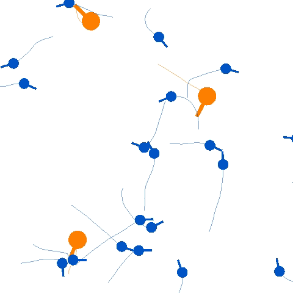

Gym-PPS is a lightweight Predator-Prey Swarm environment seamlessly integrated into the standard Gym library. Its purpose is to provide a convenient platform for rapidly testing reinforcement learning algorithms and control algorithms utilized in guidance, swarming, or formation tasks.

Gym-PPS appears  first in the paper 

```text
@article{li2023predator,
  title={Predator--prey survival pressure is sufficient to evolve swarming behaviors},
  author={Li, Jianan and Li, Liang and Zhao, Shiyu},
  journal={New Journal of Physics},
  volume={25},
  number={9},
  pages={092001},
  year={2023},
  publisher={IOP Publishing}
}
```

Please note that the current version of Gym-PPS supports Python 3.8. Therefore, it is recommended to run the library within a Python 3.8 environment, which can be easily set up using a virtual environment such as `venv`.

We have plans to publish the project on PyPI in the near future. However, at this stage, the library needs to be manually installed.

```bash
python setup.py install
```

To quick start, run the following test example:

```bash
cd example_pps
python test_pps.py
```

A simulation window will pop up:


To customize the parameters of the environment, such as the number of predators and the dynamics mode, you can easily specify the desired values in the `custom_param.json` file, as shown below:

```json
{
    "dynamics_mode": "Polar",
    "n_p": 3,
    "n_e": 10,
    "pursuer_strategy": "random",
    "escaper_strategy": "nearest",
    "is_periodic": true
}
```

To customize your own observation or reward functions, modify the functions in `custom_env.py`:

```python
class MyObs(gym.ObservationWrapper):

    def __init__(self, env):
        super().__init__(env)
        self.observation_space = spaces.Box(shape=(2, env.n_p+env.n_e), low=-np.inf, high=np.inf)

    def observation(self, obs):
        r"""Example::

        n_pe = self.env.n_p + self.env.n_e
        obs = np.ones((2, n_pe))
        return obs

        """
        return obs
        

class MyReward(gym.RewardWrapper):
    
    def reward(self, reward):
        r"""Example::

        reward = np.sum(self.env.is_collide_b2b)

        """
        
        return reward
```

Below is a list of the parameters that can be customized:

| Parameter name          | Meaning                                                   | Default value |
| ----------------------- | --------------------------------------------------------- | ------------- |
| n_p                     | number of predators                                       | 3             |
| n_e                     | number of prey                                            | 10            |
| is_periodic             | whether the environment is periodic                       | True          |
| pursuer_strategy        | embedded pursuer control algorithm                        | 'input'       |
| escaper_strategy        | embedded prey control algorithm                           | 'input'       |
| penalize_control_effort | whether to penalize control effort in reward functions    | True          |
| penalize_collide_walls  | whether to penalize wall collision in reward functions    | False         |
| penalize_distance       | whether to penalize predator-prey distance in reward      | False         |
| penalize_collide_agents | whether to penalize agents collisions in reward functions | False         |
| FoV_p                   | Field of View for predators                               | 5             |
| FoV_e                   | Field of View for prey                                    | 5             |
| topo_n_p2e              | topological distance for predators seeing prey            | 5             |
| topo_n_e2p              | topological distance for prey seeing predators            | 2             |
| topo_n_p2p              | topological distance for predators seeing predators       | 2             |
| topo_n_e2e = 5          | topological distance for prey seeing prey                 | 5             |
| m_p                     | mass of predators                                         | 3             |
| m_e                     | mass of prey                                              | 1             |
| size_p                  | size of predators                                         | 0.06          |
| size_e                  | size of prey                                              | 0.035         |
| render_traj             | whether to render trajectories                            | True          |


Gym is now being maintained, but new major features are not intended. See [this post](https://github.com/openai/gym/issues/2259) for more information.

## Gym

Gym is an open source Python library for developing and comparing reinforcement learning algorithms by providing a standard API to communicate between learning algorithms and environments, as well as a standard set of environments compliant with that API. Since its release, Gym's API has become the field standard for doing this.

Gym currently has two pieces of documentation: the [documentation website](http://gym.openai.com) and the [FAQ](https://github.com/openai/gym/wiki/FAQ). A new and more comprehensive documentation website is in the works.

## Installation

To install the base Gym library, use `pip install gym`.

This does not include dependencies for all families of environments (there's a massive number, and some can be problematic to install on certain systems). You can install these dependencies for one family like `pip install gym[atari]` or use `pip install gym[box2d]` to install all dependencies.

We support Python 3.6, 3.7, 3.8 and 3.9 on Linux and macOS. We will accept PRs related to Windows, but do not officially support it.

## API

The Gym API's API models environments as simple Python `env` classes. Creating environment instances and interacting with them is very simple- here's an example using the "CartPole-v1" environment:

```python
import gym 
env = gym.make('CartPole-v1')

# env is created, now we can use it: 
for episode in range(10): 
    obs = env.reset()
    for step in range(50):
        action = env.action_space.sample()  # or given a custom model, action = policy(observation)
        nobs, reward, done, info = env.step(action)
```

## Notable Related Libraries

* [Stable Baselines 3](https://github.com/DLR-RM/stable-baselines3) is a learning library based on the Gym API. It is our recommendation for beginners who want to start learning things quickly.
* [RL Baselines3 Zoo](https://github.com/DLR-RM/rl-baselines3-zoo) builds upon SB3, containing optimal hyperparameters for Gym environments as well as code to easily find new ones. Such tuning is almost always required.
* The [Autonomous Learning Library](https://github.com/cpnota/autonomous-learning-library) and [Tianshou](https://github.com/thu-ml/tianshou) are two reinforcement learning libraries I like that are generally geared towards more experienced users.
* [PettingZoo](https://github.com/PettingZoo-Team/PettingZoo) is like Gym, but for environments with multiple agents.

## Environment Versioning

Gym keeps strict versioning for reproducibility reasons. All environments end in a suffix like "\_v0".  When changes are made to environments that might impact learning results, the number is increased by one to prevent potential confusion.

## Citation

A whitepaper from when OpenAI Gym just came out is available https://arxiv.org/pdf/1606.01540, and can be cited with the following bibtex entry:

```
@misc{1606.01540,
  Author = {Greg Brockman and Vicki Cheung and Ludwig Pettersson and Jonas Schneider and John Schulman and Jie Tang and Wojciech Zaremba},
  Title = {OpenAI Gym},
  Year = {2016},
  Eprint = {arXiv:1606.01540},
}
```

## Release Notes

There used to be release notes for all the new Gym versions here. New release notes are being moved to [releases page](https://github.com/openai/gym/releases) on GitHub, like most other libraries do. Old notes can be viewed [here](https://github.com/openai/gym/blob/31be35ecd460f670f0c4b653a14c9996b7facc6c/README.rst).
